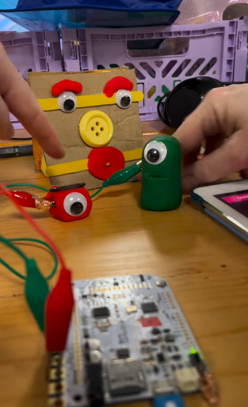

# Tech-Art Fest
Feb 21st - Feb 23rd
Basildon

---

# Overview

- tech-art exhibition + talks and workshops
- mainly more local artists
- aimed at "opening-up" tech-art to general public

---

# Friday

- Opening + "Music Generator"
- Performers: Thunkist, Echo of the Mixer, hellocatfood

---

# Exhibition: You Have a New Follower

- robotic arm + "never-ending" IG stream
- software - python and opencv

---

# Exhibition: LEDs
Alexander Johansson

- LED golf using door knobs - use unusual "controllers" to attract attention
- LED plants built with MicroBits
- Makey Makey

---

# Makey Makey

---

# Exhibition: 

- select a mask and place it on the "conversation" panel
- have a conversation with a different archetype

---

# Music Generator - Thunkist

- primarily works with dancers
- smart watches connected to Ableton
- audience involvement
- considered his TouchDesigner knowledge "basic"
- wands also capable of controlling which speaker the sound comes from

---

# Saturday

- algorave workshop (TidalCycles)
- controller talk

---

# Sunday

- dream instrument workshop 
- prosthetics talk

---

# Dream Instrument

- could be done in around 20 minutes
- use some sponges + slug repellent tape to create a "button"
- combine with MIDI and the Koala software to cause pushing the button to create a sound

