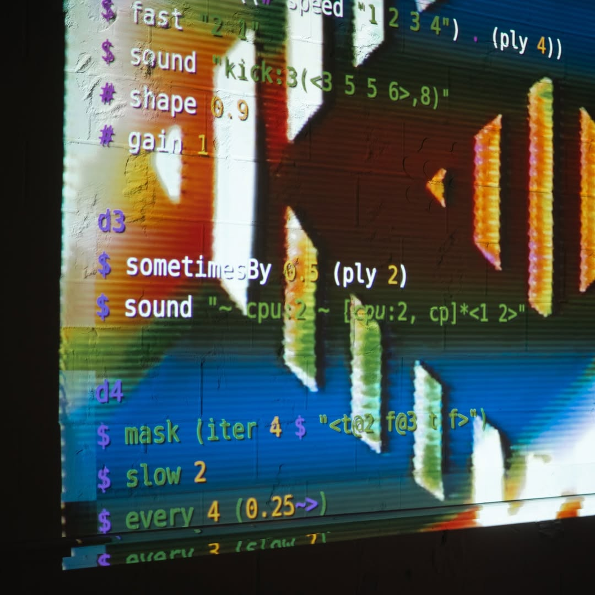
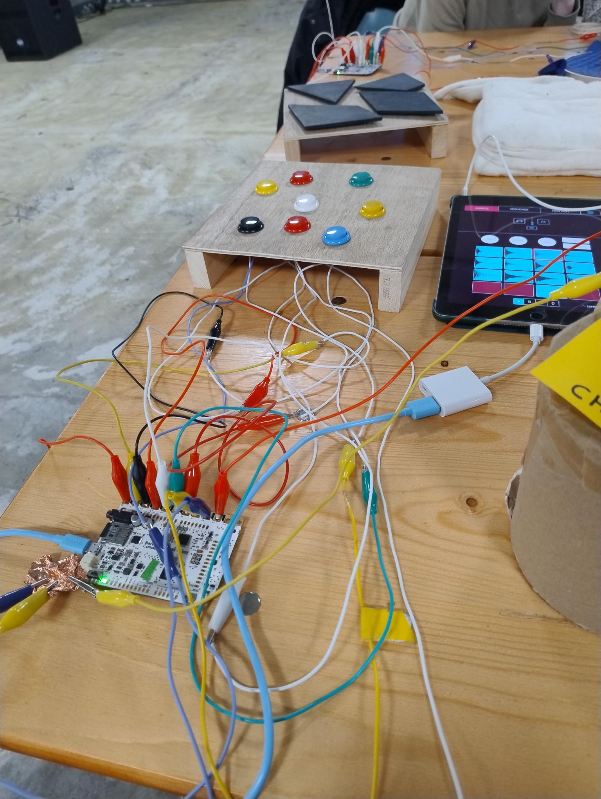
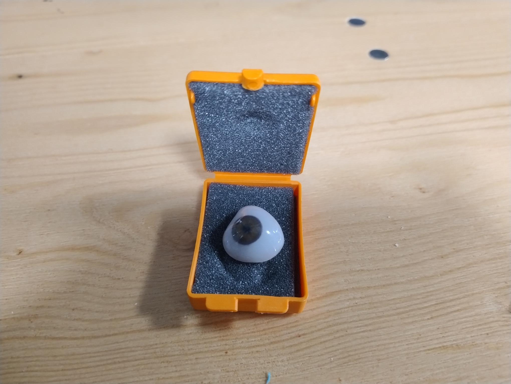
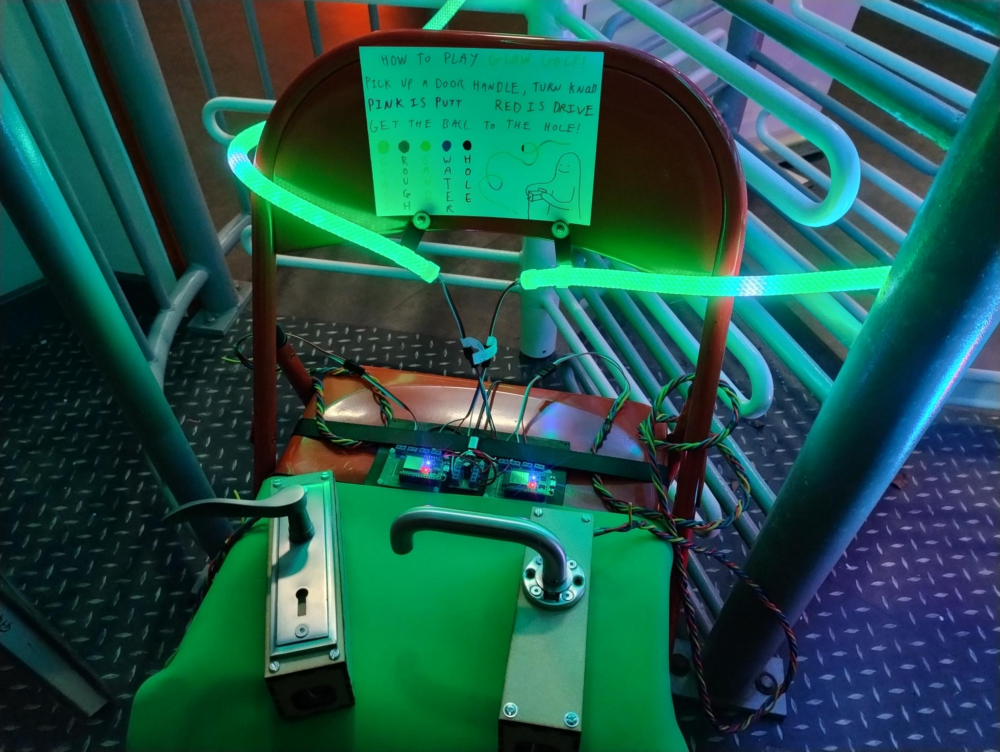
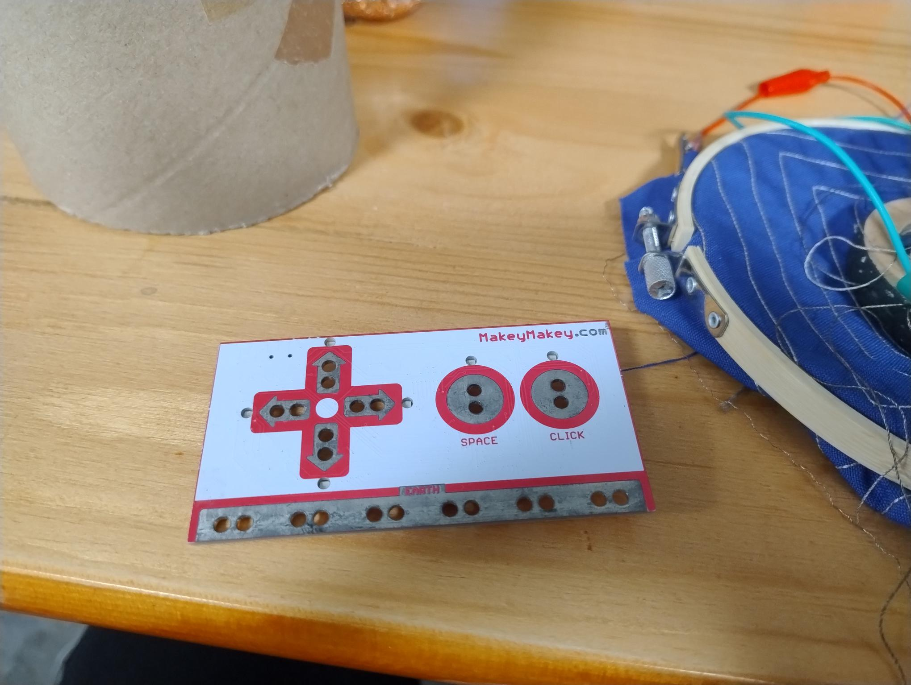
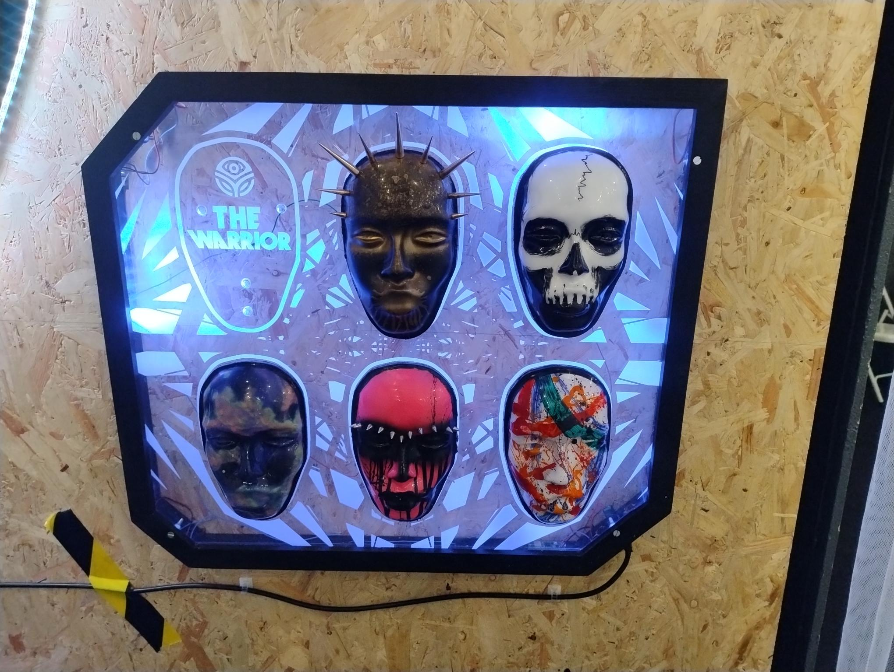
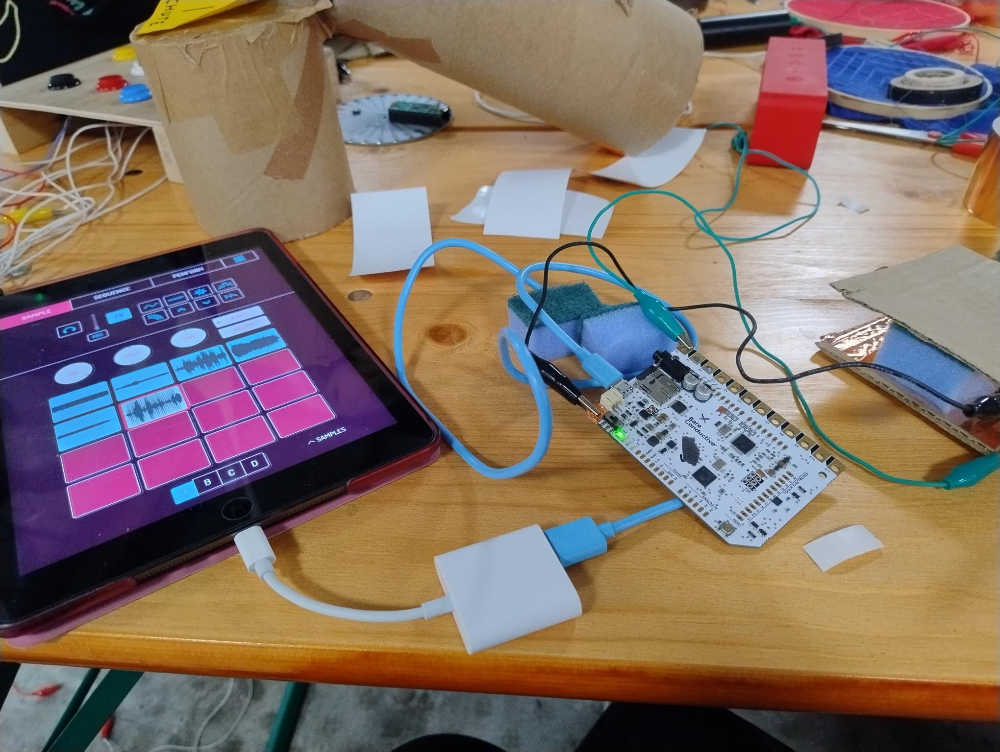

# Tech-Art Fest
Feb 21st - Feb 23rd
Basildon

<!-- 
- three-day tech-art event
- tech-art exhibition + artist-led talks and workshops
- completely open to the public
- music, physical computing, digital paintings
-->

---

# Friday

- Opening + "Music Generator"
- Performers: Thunkist, Echo of the Mixer, hellocatfood

---

# Saturday

- algorave workshop (TidalCycles)
- controller talk

---

# Sunday

- dream instrument workshop 
- prosthetics talk

---

# Thunkist (installation + peformance)

<video height="580" controls>
  <source src="./content/thunkist-half.mp4" type="video/mp4">
  Your browser does not support the video tag.
</video>

<!-- 
- "movement-activated electronic music"
- handed out three "wands" to the audience
- each contain a smart watch running flowfal
- flowfal sends messages to Ableton - deciding which speaker to emits the most sound, controlling animations, affecting which portion of some audio is part of the overall song
- often works with dancers
 -->

---

<video height="600" controls>
  <source src="./content/thunkist-wands.mp4" type="video/mp4">
  Your browser does not support the video tag.
</video>

<!-- A better view of how the wands interact with TouchDesigner -->

---

# Echo of the Mixer

<video height="580" controls>
  <source src="./content/echo-of-the-mixer-half.mp4" type="video/mp4">
  Your browser does not support the video tag.
</video>

<!-- 
Didn't talk to this person but it looked like a lot of StableDifussion img2img -->

---

# hellocatfood

- TidalCycles and Hydra

<!-- Peformance using TidalCycles and Hydra for visuals -->

---

# Tate

<video height="580" controls>
  <source src="./content/hellocatfood-tate.mp4" type="video/mp4">
  Your browser does not support the video tag.
</video>

---

# Exhibition: You Have a New Follower

- robotic arm + "never-ending" IG stream
- software - python and opencv

---

<video height="600" controls>
  <source src="./content/new-follower.mp4" type="video/mp4">
  Your browser does not support the video tag.
</video>

<!-- My "Hmmm" and gum chewing can he heard here...
- An engineer who moved into art
- 3D printed and assembled the art himself
 -->

---

# Exhibition: Alexander Johansson

- LED golf using door knobs - use unusual "controllers" to attract attention
- LED plants built with MicroBits

---

# Makey Makey

<!-- Spoke highly of these. Said they did what he needed for plenty of installations and that he didn't have to use Arduinos until relatively recently. Problem is they are hard to find new, but he finds that schools tend to sell off the ones they no longer need on eBay at a good discount. Seemed to think they were less hassle - not that Arduinos don't have their uses. -->

---

# Exhibition: 

- select a mask and place it on the "conversation" panel
- have a conversation with a different archetype

---

# Workshop: Dream Instrument

- could be done in around 20 minutes
- use some sponges + slug repellent tape to create a "button"
- combine with MIDI and the Koala software to cause pushing the button to create a sound

